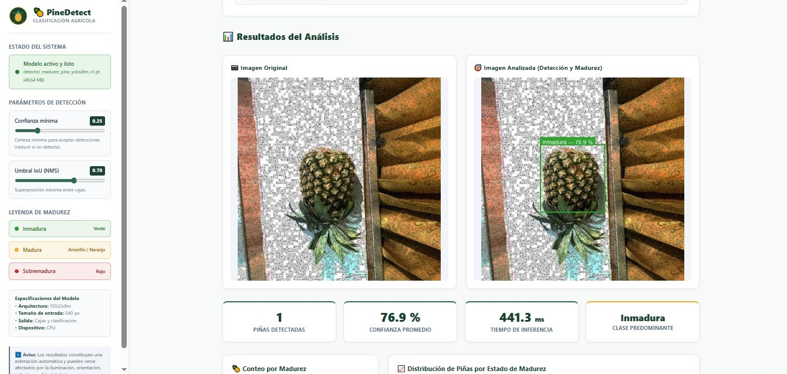
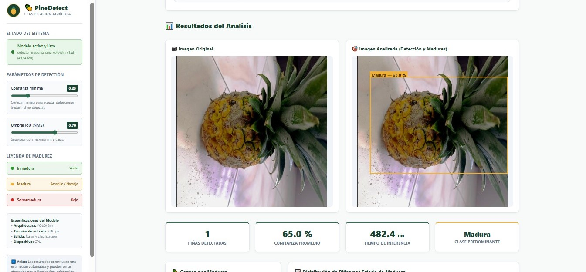

# PineDetect 🍍
### Sistema Inteligente de Detección y Clasificación del Estado de Madurez de Piñas mediante Visión por Computador

---

## 📑 Índice de Contenidos

1. [Título y Descripción](#1-título-y-descripción)
2. [Relación con el Objetivo de la Tesis](#2-relación-con-el-objetivo-de-la-tesis)
3. [Alcance Funcional](#3-alcance-funcional)
4. [Modelo Utilizado](#4-modelo-utilizado)
5. [Flujo de Funcionamiento](#5-flujo-de-funcionamiento)
6. [Estructura del Proyecto](#6-estructura-del-proyecto)
7. [Instalación y Ejecución Local](#7-instalación-y-ejecución-local)
8. [Guía de Uso del Aplicativo](#8-guía-de-uso-del-aplicativo)
9. [Interpretación de Resultados](#9-interpretación-de-resultados)
10. [Validación y Selección Metodológica del Modelo](#10-validación-y-selección-metodológica-del-modelo)
11. [Limitaciones del Sistema](#11-limitaciones-del-sistema)
12. [Tecnologías Utilizadas](#12-tecnologías-utilizadas)
13. [Parámetros de Reproducibilidad](#13-parámetros-de-reproducibilidad)
14. [Autoría y Contexto Académico](#14-autoría-y-contexto-académico)
15. [Licencias y Atribución](#15-licencias-y-atribución)
16. [Lista de Comprobación del Objetivo Específico](#16-lista-de-comprobación-del-objetivo-específico)

---

## 1. Título y Descripción

**PineDetect** es un aplicativo de software inteligente desarrollado para automatizar la localización espacial y la clasificación del estado de madurez de frutos de piña (*Ananas comosus*) a partir de imágenes digitales en el espectro visible (RGB).

El sistema categoriza cada fruto detectado en uno de tres estados fenológicos de madurez:
- **Inmadura** (cáscara con tonalidad predominantemente verde).
- **Madura** (cáscara en transición óptima amarillo/dorado/naranja).
- **Sobremadura** (cáscara con viraje avanzado a tonalidades rojizas o pardo-rojizas).

> **Aclaración técnica:** El software opera bajo el paradigma de **detección de objetos mediante cajas delimitadoras (*bounding boxes*)** y estimación de probabilidad de pertenencia a clase. El sistema **no** realiza segmentación semántica ni genera máscaras a nivel de píxel.

### 📸 Vista Previa del Aplicativo

| Detección de Fruto Inmaduro (76.9 % Confianza) | Detección de Fruto Maduro (65.0 % Confianza) |
| :---: | :---: |
|  |  |
| *Identificación con caja delimitadora verde (`#2CA02C`) y panel de métricas.* | *Identificación con caja delimitadora amarilla (`#F2B134`) e inferencia en tiempo real.* |

---

## 2. Relación con el Objetivo de la Tesis

El desarrollo de PineDetect responde de forma directa al objetivo específico planteado en la investigación:

> *“Implementar el modelo con mejor desempeño en un aplicativo inteligente que permita el procesamiento automático, la inferencia y la visualización de resultados.”*

PineDetect materializa este objetivo al integrar la arquitectura de red neuronal convolucional/atencional previamente entrenada dentro de un entorno web interactivo, robusto y accesible, que abarca desde la ingesta de datos hasta la generación de reportes estructurados para el control de calidad agrícola.

### Matriz de Cumplimiento del Objetivo Específico

| Componente del Objetivo | Implementación en PineDetect | Evidencia Verificable |
| :--- | :--- | :--- |
| **Aplicativo inteligente** | Interfaz web interactiva (Streamlit / Django) con diseño institucional, panel de parámetros y gestión en memoria. | Módulos `app.py`, `templates/`, `static/`, `src/config.py`. |
| **Modelo con mejor desempeño** | Despliegue de la red **YOLOv8m** (`detector_madurez_pina_yolov8m_v1.pt`), seleccionada formalmente mediante métricas de validación ($mAP@0.50:0.95$). | Registro en `models/manifest.json`, `models/metricas/` y pesos en `models/`. |
| **Procesamiento automático** | Pipeline de validación de archivos, corrección de orientación EXIF, decodificación RGB y adaptación dimensional sin intervención manual. | Módulos `src/validators.py` y `src/inference.py`. |
| **Inferencia** | Ejecución local y determinista del modelo con YOLOv8, extrayendo coordenadas $xyxy$, clase predicha, confianza y tiempo de cómputo en milisegundos. | Función `run_pineapple_detection` en `src/inference.py`. |
| **Visualización de resultados** | Renderizado en alta resolución de cajas delimitadoras con colores de contraste, tarjetas de métricas, gráfico de distribución y descargas en PNG, CSV y JSON. | Módulos `src/visualization.py`, `src/exporters.py` y panel de resultados en UI. |

*Nota metodológica:* La selección de YOLOv8m correspondió al modelo ganador en la etapa de validación ($mAP@0.50:0.95 = 0.8113$). No se afirma que haya obtenido el valor más alto en la totalidad de submétricas del conjunto de prueba (*test*), el cual se mantuvo reservado exclusivamente con fines de evaluación de generalización.

---

## 3. Alcance Funcional

El sistema provee las siguientes capacidades operativas:

1. **Ingesta multiformato:** Carga de imágenes en formatos estándar `JPG`, `JPEG`, `PNG` y `WEBP`.
2. **Validación de integridad:** Verificación estricta de tamaño máximo (hasta 10 MB), dimensiones no nulas, consistencia estructural con Pillow y conversión garantizada a espacio de color RGB.
3. **Detección multiobjeto:** Capacidad de localizar e identificar una o múltiples piñas en una misma fotografía.
4. **Clasificación de madurez:** Asignación taxonómica a cada detección (*inmadura*, *madura*, *sobremadura*).
5. **Estimación de confianza:** Cálculo porcentual del grado de certeza predictiva para cada fruto individualizado.
6. **Agregación estadística:** Conteo discriminado por estado de madurez, cálculo de la confianza promedio global y determinación de la clase predominante (con desempate formal).
7. **Tabla analítica de coordenadas:** Presentación tabular de detecciones con índices, confianza y límites espaciales ($X_{min}, Y_{min}, X_{max}, Y_{max}$, ancho y alto en píxeles, redondeados a 2 decimales).
8. **Gráfico interactivo de distribución:** Representación visual de frecuencias por clase mediante barras codificadas con los colores institucionales.
9. **Exportación de reportes:**
   - Descarga de la imagen analizada con cajas y etiquetas superpuestas en formato `PNG`.
   - Exportación de la tabla de detecciones en formato `CSV` con codificación `UTF-8 con BOM` (`utf-8-sig`) para compatibilidad directa con Microsoft Excel.
   - Generación de resumen técnico y metadatos en formato estructurado `JSON`.

---

## 4. Modelo Utilizado

- **Arquitectura de red:** YOLOv8m (*You Only Look Once*, variante mediana).
- **Tipo de tarea:** Detección de objetos multiclase (*Object Detection*).
- **Esquema de clases:**
  - `0`: `inmadura`
  - `1`: `madura`
  - `2`: `sobremadura`
- **Resolución espacial de entrada:** $640 \times 640$ píxeles (`imgsz=640`).
- **Umbral de confianza predeterminado:** $0.25$ ($\tau_{conf} = 0.25$, ajustable entre $0.05$ y $0.90$).
- **Umbral de IoU para NMS predeterminado:** $0.70$ ($\tau_{IoU} = 0.70$, ajustable entre $0.30$ y $0.90$).
- **Formato de pesos:** PyTorch checkpoint (`.pt`).
- **Ubicación requerida del archivo:** `models/detector_madurez_pina_yolov8m_v1.pt`.

```
                  ┌─────────────────────────────────────────┐
                  │          YOLOv8m (Un Solo Paso)         │
 Imagen (640x640) ┼─────────────────────────────────────────┼─► Bounding Box (xyxy)
                  │ Extracción Espacial + Clasificación     │─► Clase de Madurez
                  │ de Madurez Simultánea en la Misma Red   │─► Confianza [0.0 - 1.0]
                  └─────────────────────────────────────────┘
```

> **Fundamento arquitectónico:** La red resuelve en un único pase hacia adelante (*single-stage*) tanto la delimitación geométrica del fruto como la clasificación de su estado de madurez, optimizando la latencia de inferencia frente a arquitecturas de dos etapas.

---

## 5. Flujo de Funcionamiento

El procesamiento de una imagen en PineDetect sigue un flujo secuencial y determinista:

```
┌─────────────────┐     ┌──────────────────────┐     ┌──────────────────────┐
│  1. Usuario     │ ──► │  2. Validación       │ ──► │  3. Preprocesamiento │
│  Carga Imagen   │     │  Extensión, 10MB,    │     │  Orientación EXIF,   │
│  (JPG/PNG/WEBP) │     │  Integridad binaria  │     │  RGB, Escala nativa  │
└─────────────────┘     └──────────────────────┘     └──────────────────────┘
                                                                 │
                                                                 ▼
┌─────────────────┐     ┌──────────────────────┐     ┌──────────────────────┐
│  6. Renderizado │ ◄── │  5. Filtrado NMS     │ ◄── │  4. Inferencia       │
│  Cajas Pillow + │     │  Supresión no máxima │     │  Red YOLOv8m         │
│  Estadísticas   │     │  y umbrales conf/iou │     │  en memoria (GPU/CPU)│
└─────────────────┘     └──────────────────────┘     └──────────────────────┘
        │
        ▼
┌──────────────────────────────────────────────┐
│  7. Presentación y Descarga de Resultados    │
│  • Comparativa de imágenes Original vs Anotada│
│  • Métricas, gráfico interactivo y tabla     │
│  • Descarga en PNG, CSV (Excel) y JSON       │
└──────────────────────────────────────────────┘
```

---

## 6. Estructura del Proyecto

```text
PineDetect/
├── app.py                     # Punto de entrada de la interfaz gráfica interactiva (Streamlit)
├── manage.py                  # Script de gestión del servidor web alternativo (Django)
├── pinedetect_project/        # Configuración central del framework Django (settings, urls, wsgi)
├── detector/                  # Aplicación web Django (vistas REST/AJAX, controladores de exportación)
├── models/
│   ├── README.md              # Documentación de ubicación y carga del archivo de pesos
│   ├── manifest.json          # Metadatos del modelo entrenado y registro de experimentación
│   ├── detector_madurez_pina_yolov8m_v1.pt  # Pesos entrenados del modelo (formato PyTorch)
│   ├── configuracion/         # Archivos de configuración de clases e hiperparámetros
│   ├── ejemplo_inferencia/    # Script en consola para inferencia mínima
│   └── metricas/              # Reportes experimentales de validación y test de la tesis
├── src/
│   ├── __init__.py            # Inicializador del paquete principal
│   ├── config.py              # Definición de clases, colores institucionales RGB/HEX y umbrales
│   ├── model_loader.py        # Carga del modelo en memoria bajo patrón Singleton thread-safe
│   ├── inference.py           # Pipeline de predicción, cálculo de métricas y formateo de datos
│   ├── visualization.py       # Renderizado de cajas sobre resolución nativa y gráfico interactivo
│   ├── validators.py          # Validación de archivos, tamaño, integridad y orientación EXIF
│   └── exporters.py           # Generación de archivos de exportación en memoria (PNG, CSV BOM, JSON)
├── assets/
│   ├── logo_placeholder.png   # Logotipo gráfico institucional del aplicativo
│   ├── generate_logo.py       # Script generador utilitario del logotipo
│   ├── styles.css             # Hoja de estilos visuales institucionales
│   └── screenshots/           # Capturas de pantalla de la interfaz y demostración
│       ├── deteccion_inmadura.jpeg
│       └── deteccion_madura.jpeg
├── img_prueba/                # Imágenes de prueba para inferencia y validación rápida
├── static/                    # Archivos estáticos web (CSS, JS cliente, imágenes)
├── templates/                 # Plantillas HTML5 semánticas y responsivas
├── tests/
│   ├── __init__.py            # Inicializador de la suite de pruebas
│   ├── test_validators.py     # Pruebas de validación de archivos e integridad de imágenes
│   ├── test_inference_helpers.py # Pruebas de cálculo de métricas, conteos y desempate
│   ├── test_exporters.py      # Pruebas de generación y codificación de reportes (PNG, CSV, JSON)
│   └── test_django_views.py   # Pruebas de integración de endpoints web
├── .streamlit/
│   └── config.toml            # Configuración de servidor, límites de carga y tema visual
├── requirements.txt           # Lista de dependencias y versiones requeridas
├── pytest.ini                 # Configuración del entorno de pruebas unitarias
├── README.md                  # Documentación técnica completa del proyecto
├── .gitignore                 # Reglas de exclusión para control de versiones git
└── run_app.bat                # Lanzador automatizado para entorno Windows
```

---

## 7. Instalación y Ejecución Local

### Requisitos Previos
- Sistema Operativo: Windows 10/11, Linux o macOS.
- Python: Versión **3.11** o **3.12** instalada.
- Gestor de paquetes `pip`.

### Paso 1: Clonar o Descargar el Repositorio
Ubicarse en el directorio raíz del proyecto:
```powershell
cd PineDetect
```

### Paso 2: Creación y Activación del Entorno Virtual (Windows)
```powershell
python -m venv .venv
.venv\Scripts\activate
```

*(En Linux / macOS utilizar: `source .venv/bin/activate`)*

### Paso 3: Instalación de Dependencias
```powershell
pip install -r requirements.txt
```

### Paso 4: Colocación del Archivo de Pesos del Modelo
Asegurarse de que el archivo `.pt` esté copiado en la ruta:
```text
PineDetect/models/detector_madurez_pina_yolov8m_v1.pt
```

### Paso 5: Ejecución del Aplicativo

**Opción A: Ejecución con Streamlit (Recomendada)**
```powershell
streamlit run app.py
```

**Opción B: Ejecución con Django**
```powershell
python manage.py runserver
```

**Opción C: Acceso Rápido en Windows**
Hacer doble clic en el archivo ejecutable por lotes:
```text
run_app.bat
```

Una vez iniciado, abrir el navegador en la dirección indicada (típicamente `http://localhost:8501` para Streamlit o `http://127.0.0.1:8000` para Django).

---

## 8. Guía de Uso del Aplicativo

1. **Verificar el Estado del Sistema:**
   - Comprobar en la barra lateral que el indicador señale `🟢 Modelo cargado correctamente` o `Modelo activo y listo`.
2. **Cargar la Imagen:**
   - Arrastrar un archivo de imagen (`.jpg`, `.jpeg`, `.png`, `.webp`) sobre la zona demarcada o hacer clic para seleccionarlo.
3. **Ajuste Opcional de Parámetros:**
   - Si la escena presenta baja iluminación o tomas lejanas, reducir la **Confianza mínima** (ej. a $0.15$ o $0.20$). Para la mayoría de los casos, mantener el valor predeterminado ($0.25$).
4. **Ejecutar el Análisis:**
   - Hacer clic en el botón principal **"🍍 Analizar imagen"**.
5. **Inspeccionar los Resultados:**
   - Comparar visualmente la imagen original frente a la imagen procesada con cajas y etiquetas.
   - Revisar las tarjetas de resumen (total de piñas, confianza promedio, tiempo de inferencia y clase predominante).
   - Analizar el gráfico de distribución por madurez y la tabla de coordenadas espaciales.
6. **Descargar Reportes:**
   - Utilizar los botones inferiores para exportar la imagen resultante (`PNG`), el reporte tabular (`CSV`) o los metadatos analíticos (`JSON`).

### 🖼️ Demostración de Resultados en la Interfaz

A continuación se presentan ejemplos reales del procesamiento generado por PineDetect:

#### Caso 1: Detección y Clasificación de Piña Inmadura

*Figura 1: Detección de fruto inmaduro con confianza del 76.9 %, tiempo de inferencia de 441.3 ms, resumen estadístico y panel lateral de parámetros.*

#### Caso 2: Detección y Clasificación de Piña Madura

*Figura 2: Detección de fruto maduro con confianza del 65.0 %, tiempo de inferencia de 482.4 ms y robustez ante variaciones de orientación del fruto.*

---

## 9. Interpretación de Resultados

Las predicciones visuales y numéricas se interpretan bajo el siguiente estándar:

| Estado de Madurez | Color Distintivo | Código Hex | Significado Agronómico |
| :---: | :---: | :---: | :--- |
| **Inmadura** | Verde | `#2CA02C` | Fruto en etapa temprana/intermedia; cáscara verde sin viraje cromático a maduración. |
| **Madura** | Amarillo / Naranja | `#F2B134` | Fruto en estado comercial óptimo; cáscara con desarrollo uniforme de pigmentación amarilla. |
| **Sobremadura** | Rojo / Pardo | `#D62728` | Fruto en senescencia o maduración avanzada; cáscara con tonalidades rojizas o pardas. |

> **Nota sobre el porcentaje de confianza:** El valor porcentual mostrado (ej. `Madura — 91.4 %`) corresponde al **nivel de certeza estadística (*confidence score*) asignado por el modelo** a la detección y clasificación. **No representa una medición física ni bioquímica directa del porcentaje de azúcar o índice refractométrico del fruto.**

---

## 10. Validación y Selección Metodológica del Modelo

Conforme a la metodología experimental de la tesis:

1. **Protocolo de Selección Pre-Test:** La selección del modelo ganador se llevó a cabo utilizando exclusivamente el conjunto de **validación** (*val split*), empleando el $mAP@0.50:0.95$ como criterio principal de decisión, resultando seleccionado el experimento **E3 (YOLOv8m)**.
2. **Conjunto de Prueba Congelado:** El conjunto de prueba (*test split*) permaneció ciego durante el ajuste y se utilizó únicamente en la etapa final para reportar la capacidad de generalización del sistema.
3. **Evaluación Desacoplada:** Se analizaron tanto la precisión en la localización espacial de los frutos como el desempeño en la clasificación de madurez multiclase.
4. **Respaldo Documental:** Los reportes formales, matrices de confusión y análisis estadísticos complementarios (Friedman, Wilcoxon-Holm y Bootstrap) se encuentran archivados en la carpeta `models/metricas/` del repositorio y en los anexos de la tesis.

---

## 11. Limitaciones del Sistema

Para un uso e interpretación adecuados, deben considerarse las siguientes restricciones:

- **Inspección Óptica Externa:** El sistema procesa imágenes superficiales en el espectro visible; **no mide propiedades químicas internas** como sólidos solubles totales (°Brix), pH o acidez titulable.
- **Sensibilidad a Condiciones de Toma:** Sombras pronunciadas, sobreexposición lumínica, reflejos directos, desenfoques severos u oclusiones densas por follaje pueden disminuir la confianza de detección.
- **Carácter No Invasivo de Apoyo:** La herramienta está concebida como un **soporte tecnológico al control de calidad** y no sustituye pruebas destructivas de laboratorio ni inspecciones bromatológicas oficiales.
- **Delimitación por Cajas:** La salida geométrica se restringe a rectángulos delimitadores orientados a los ejes ($xyxy$) y no proporciona el contorno perimétrico exacto del fruto.

---

## 12. Tecnologías Utilizadas

El desarrollo del software se apoya en librerías y componentes consolidados del ecosistema de Visión por Computador y desarrollo web en Python:

- **Lenguaje Base:** Python 3.11 / 3.12.
- **Entornos Web:** Streamlit (interfaz interactiva rápida) y Django (arquitectura web desacoplada).
- **Inferencia y Redes Neuronales:** Ultralytics YOLOv8, PyTorch, Torchvision.
- **Procesamiento de Imágenes:** Pillow (PIL), OpenCV (`opencv-python-headless`).
- **Análisis de Datos y Estructuración:** Pandas, NumPy, PyYAML.
- **Visualización Gráfica:** Plotly (Streamlit) y Chart.js (Django).
- **Pruebas Automatizadas:** Pytest, Pytest-Django.

---

## 13. Parámetros de Reproducibilidad

Para garantizar la reproducibilidad técnica de las pruebas y la ejecución:

| Parámetro | Valor Predeterminado / Requerimiento |
| :--- | :--- |
| **Versión de Python** | `3.11.x` o `3.12.x` |
| **Instalador de paquetes** | `pip install -r requirements.txt` |
| **Ruta del modelo** | `models/detector_madurez_pina_yolov8m_v1.pt` |
| **Tamaño de entrada (`imgsz`)** | `640` |
| **Confianza mínima (`conf`)** | `0.25` |
| **IoU NMS (`iou`)** | `0.70` |
| **Verificación de pruebas** | `pytest -v` (24 pruebas automatizadas) |

---

## 14. Autoría y Contexto Académico

- **Proyecto:** PineDetect — Aplicativo Inteligente para la Detección y Clasificación del Estado de Madurez de Piñas.
- **Contexto:** Trabajo de investigación para la obtención del título profesional.
- **Autor:** [NOMBRE DEL TESISTA]
- **Asesor:** [ASESOR]
- **Universidad:** [UNIVERSIDAD]
- **Facultad:** [FACULTAD]
- **Escuela Profesional:** [ESCUELA PROFESIONAL]
- **Año:** [AÑO]

---

## 15. Licencias y Atribución

- **Código Fuente de PineDetect:** [Pendiente de completar / Licencia MIT].
- **Framework YOLOv8:** Ultralytics (licenciado bajo AGPL-3.0 / Licencia Comercial Ultralytics).
- **Conjunto de Datos (*Dataset*):** Colección fotográfica de piñas y anotaciones de madurez desarrolladas para la tesis [Pendiente de completar / Uso Académico Exclusivo].

---

## 16. Lista de Comprobación del Objetivo Específico

Verificación de cumplimiento de las dimensiones del objetivo de la tesis:

- [x] **Modelo con mejor desempeño:** Se implementó el modelo ganador de validación **YOLOv8m** sin modificaciones en su arquitectura ni reentrenamiento.
- [x] **Aplicativo inteligente funcional:** El software se ejecuta localmente mediante interfaz web moderna, intuitiva y en idioma español.
- [x] **Procesamiento automático:** La aplicación valida, reorienta y escala las imágenes de forma transparente para el usuario.
- [x] **Inferencia determinista:** Se ejecuta la red sobre imágenes individuales o lotes multiobjeto extrayendo cajas, clases y probabilidades de confianza.
- [x] **Visualización enriquecida:** Se generan vistas comparativas, tarjetas de métricas cuantitativas y gráficos de distribución por madurez.
- [x] **Exportación y trazabilidad:** Se permite la descarga directa de las imágenes anotadas (`PNG`), reportes tabulares para Excel (`CSV`) y esquemas estructurados (`JSON`).
